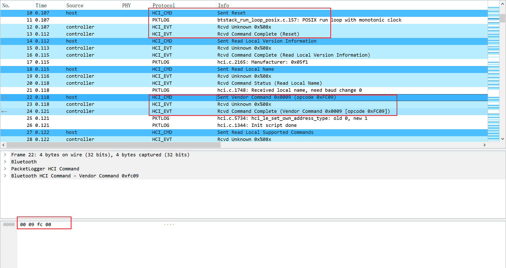

[项目文档](ttps://hci-middleware.readthedocs.io/zh_CN/latest/)


## 输入输出计划

| 输入                                                    | 输出                                                         |
| ------------------------------------------------------- | ------------------------------------------------------------ |
| btstack 的 chipset 层                                   | 1. Zephyr Controller, BCM, CSR 蓝牙卡片自定义的 Vendor HCI 命令<br />2. btstack 的 chipset 层介绍，以及如何在 btstack 里找到某一款蓝牙卡片的初始化流程<br />3. Chipset 初始化方式（warm） |
| btstack，Zephyr 的 HCI Transport 层，以及 H4 和 H5 协议 | 1. 整理常用的数据发送模式（如 DMA，同步异步），最终形成 H4 和 H5 的接口<br />2. 整理 H4 和 H5 协议内容 |
| RT-Thread 的 Serial 框架                                | 1. Serial 框架功能介绍<br />2. 实现 HCI Transport 接口       |
| btstack，nimble 的 HCI 层                               | 1. 协议栈 HCI 对接 HCI Transport 的接口<br />2. 利用自己的 H4 和 H5 接口对接 HCI |


## Chipset Init

`chipset_next_command` 返回值的含义：

- `BTSTACK_CHIPSET_VALID_COMMAND`：buffer 里存的是一个有效的 HCI 命令，需要发送，且后续还有 HCI 命令需发送。
- `BTSTACK_CHIPSET_DONE`：所有的 HCI 命令发送完毕。
- `BTSTACK_CHIPSET_WARMSTART_REQUIRED`：用于 CSR 的 warm boot 。
- `BTSTACK_CHIPSET_NO_INIT_SCRIPT`：表明无初始化脚本。

Chipset 初始化命令在 HCI Reset 之后发送。

### Zephyr Controller

HCI Vendor command :

```
0x00 0x09 0xfc 0x00
```

图示如下：



会有许多 0x6e 0x00 的事件传递给 Host 。Spec 5.2 里定义的最大 Event Code 为 0x58 。

### bcm

AP6216A 内使用的是 bcm 内核，其初始化 HCI Vendor command 较为复杂：

首先发送命令

```
0x00 0x2e 0xfc 0x00
```

表示下载命令，然后需要打开 `BCM43430A1.hcd` 文件，里面存储着一条条 HCI 命令，每次取出一条 HCI 命令并发送，这样就完成了初始化过程。

之后还需要设置 bd addr ，

```
0x00 0x01 0xfc 0x06 xx xx xx xx xx xx
```

当然，还有命令用于设置波特率

```
0x00 0x18 0xfc 0x06 0x00 0x00 xx xx xx xx
```


### CSR

[CSR8311 扩展板](https://item.taobao.com/item.htm?spm=a1z10.5-c-s.w4002-22329603914.14.13a17dbeSauQe3&id=622837949775) 与 [FT232 USB 转串口](https://detail.tmall.com/item.htm?spm=a1z10.5-b-s.w4011-22714387486.60.7af24f0a6ubUSP&id=605757548680&rn=7bc09cc370abd34a1328dfd03191144c&abbucket=13) 接线图。 

- 5V - VCCIO
- GND - GND
- RX - RXD
- TX - TXD
- RTS - RTS#
- CTS - CTS#

上述接线并没有将 RT TX 反接，RTS CTS 反接，是因为 CSR8311 扩展板的设计原因，需要注意。

CSR 好像有一个 warm boot

```C
// minimal CSR init script to configure PSKEYs and activate them. It uses store 0x0008 = psram.
static const uint8_t init_script[] = { 

    // 0x01fe: Set ANA_Freq to 26MHz
    0x00, 0xFC, 0x13, 0xc2, 0x02, 0x00, 0x09, 0x00, 0x01, 0x00, 0x03, 0x70, 0x00, 0x00, 0xfe, 0x01, 0x01, 0x00, 0x08, 0x00, 0x90, 0x65,

    // 0x00f2: Set HCI_NOP_DISABLE
    0x00, 0xFC, 0x13, 0xc2, 0x02, 0x00, 0x09, 0x00, 0x01, 0x00, 0x03, 0x70, 0x00, 0x00, 0xf2, 0x00, 0x01, 0x00, 0x08, 0x00, 0x01, 0x00,

#ifdef ENABLE_SCO_OVER_HCI
    // 0x01ab: Set HOSTIO_MAP_SCO_PCM to 0
    0x00, 0xFC, 0x13, 0xc2, 0x02, 0x00, 0x09, 0x00, 0x01, 0x00, 0x03, 0x70, 0x00, 0x00, 0xab, 0x01, 0x01, 0x00, 0x08, 0x00, 0x00, 0x00,
    // 0x01b0: Set HOSTIO_MAP_SCO_CODEC to 0
    0x00, 0xFC, 0x13, 0xc2, 0x00, 0x00, 0x09, 0x00, 0x03, 0x00, 0x03, 0x70, 0x00, 0x00, 0xb0, 0x01, 0x01, 0x00, 0x08, 0x00, 0x00, 0x00,
    // 0x22c9: Set ENABLE_SCO_STREAMS to 0
    0x00, 0xFC, 0x13, 0xc2, 0x02, 0x00, 0x09, 0x00, 0x01, 0x00, 0x03, 0x70, 0x00, 0x00, 0xc9, 0x22, 0x01, 0x00, 0x08, 0x00, 0x00, 0x00,
#endif

    // 0x01bf: Enable RTS/CTS for BCSP (0806 -> 080e)
    0x00, 0xFC, 0x13, 0xc2, 0x02, 0x00, 0x09, 0x00, 0x01, 0x00, 0x03, 0x70, 0x00, 0x00, 0xbf, 0x01, 0x01, 0x00, 0x08, 0x00, 0x0e, 0x08,

    // 0x01ea: Set UART baudrate to 115200
    0x00, 0xFC, 0x15, 0xc2, 0x02, 0x00, 0x0a, 0x00, 0x02, 0x00, 0x03, 0x70, 0x00, 0x00, 0xea, 0x01, 0x02, 0x00, 0x08, 0x00, 0x01, 0x00, 0x00, 0xc2,

    // 0x0001: Set Bluetooth address 
    0x00, 0xFC, 0x19, 0xc2, 0x02, 0x00, 0x0A, 0x00, 0x03, 0x00, 0x03, 0x70, 0x00, 0x00, 0x01, 0x00, 0x04, 0x00, 0x08, 0x00, 0xf3, 0x00, 0xf5, 0xf4, 0xf2, 0x00, 0xf2, 0xf1,

    //  WarmReset
    0x00, 0xFC, 0x13, 0xc2, 0x02, 0x00, 0x09, 0x00, 0x03, 0x0e, 0x02, 0x40, 0x00, 0x00, 0x00, 0x00, 0x00, 0x00, 0x08, 0x00, 0x00, 0x00,
};
```

对于命令 `0x01ea`，其最后 4 个字节用于波特率设置，`0x01, 0x00, 0x00, 0xc2`，这四个字节是两个 `uint16_t` 数据的小端存储，因此得到的数据为 `0x0001, 0xc200`，前一个为高 16 位，后一个位低 16 位，因此波特率为 `0x1c200`，即 115200 。

## HCI Transport

### BTStack 

`btstack_uart.h` 

```C
typedef struct {
    /**
     * init transport
     * @param uart_config
     */
    int (*init)(const btstack_uart_config_t * uart_config);

    /**
     * open transport connection
     */
    int (*open)(void);

    /**
     * close transport connection
     */
    int (*close)(void);

    /**
     * set callback for block received. NULL disables callback
     */
    void (*set_block_received)(void (*block_handler)(void));

    /**
     * set callback for sent. NULL disables callback
     */
    void (*set_block_sent)(void (*block_handler)(void));

    /**
     * set baudrate
     */
    int (*set_baudrate)(uint32_t baudrate);

    /**
     * set parity
     */
    int  (*set_parity)(int parity);

    /**
     * set flowcontrol
     */
    int  (*set_flowcontrol)(int flowcontrol);

    /**
     * receive block
     */
    void (*receive_block)(uint8_t *buffer, uint16_t len);

    /**
     * send block
     */
    void (*send_block)(const uint8_t *buffer, uint16_t length);


    /** Support for different Sleep Modes in TI's H4 eHCILL and in H5 - can be set to NULL if not used */

    /**
     * query supported wakeup mechanisms
     * @return supported_sleep_modes mask
     */
     int (*get_supported_sleep_modes)(void);

    /**
     * set UART sleep mode - allows to turn off UART and it's clocks to save energy
     * Supported sleep modes:
     * - off: UART active, RTS low if receive_block was called and block not read yet
     * - RTS high, wake on CTS: RTS should be high. On CTS pulse, UART gets enabled again and RTS goes to low
     * - RTS low, wake on RX: data on RX will trigger UART enable, bytes might get lost
     */
    void (*set_sleep)(btstack_uart_sleep_mode_t sleep_mode);

    /** 
     * set wakeup handler - needed to notify hci transport of wakeup requests by Bluetooth controller
     * Called upon CTS pulse or RX data. See sleep modes.
     */
    void (*set_wakeup_handler)(void (*wakeup_handler)(void));


    /** Support for HCI H5 Transport Mode - can be set to NULL for H4 */

    /**
     * H5/SLIP only: set callback for frame received. NULL disables callback
     */
    void (*set_frame_received)(void (*frame_handler)(uint16_t frame_size));

    /**
     * H5/SLIP only: set callback for frame sent. NULL disables callback
     */
    void (*set_frame_sent)(void (*block_handler)(void));

    /**
     * H5/SLIP only: receive SLIP frame
     */
    void (*receive_frame)(uint8_t *buffer, uint16_t len);

    /**
     * H5/SLIP only: send SLIP frame
     */
    void (*send_frame)(const uint8_t *buffer, uint16_t length);

} btstack_uart_t;
```


- `set_block_received` 用于设置接收数据成功的回调函数，主要用于通知操作完成。
- `set_block_sended` 用于设置发送数据成功的回调函数，主要用于通知操作完成。
- `receive_block` 用于接收数据
- `send_block` 用于发送数据，（block 是指数据块的意思）

- `set_baudrate` 设置波特率
- `set_parity` 设置奇偶校验
- `set_flowcontrol` 设置流控

- `set_frame_received` 接收一帧 H5 数据的回调函数
- `set_frame_sent` 发送一帧 H5 数据的回调函数
- `receive_frame` 接收 H5 数据帧
- `send_frame` 发送 H5 数据帧


`hci_transport.h`

```C
/* HCI packet types */
typedef struct {
    /**
     * transport name 
     */
    const char * name;

    /**
     * init transport
     * @param transport_config
     */
    void   (*init) (const void *transport_config);

    /**
     * open transport connection
     */
    int    (*open)(void);

    /**
     * close transport connection
     */
    int    (*close)(void);

    /**
     * register packet handler for HCI packets: ACL, SCO, and Events
     */
    void   (*register_packet_handler)(void (*handler)(uint8_t packet_type, uint8_t *packet, uint16_t size));

    /**
     * support async transport layers, e.g. IRQ driven without buffers
     */
    int    (*can_send_packet_now)(uint8_t packet_type);

    /**
     * send packet
     */
    int    (*send_packet)(uint8_t packet_type, uint8_t *packet, int size);

    /**
     * extension for UART transport implementations
     */
    int    (*set_baudrate)(uint32_t baudrate);

    /**
     * extension for UART H5 on CSR: reset BCSP/H5 Link
     */
    void   (*reset_link)(void);

    /**
     * extension for USB transport implementations: config SCO connections
     */
    void   (*set_sco_config)(uint16_t voice_setting, int num_connections);

} hci_transport_t;
```

核心是：

- `register_packet_handler` 注册一个接收回调函数，在里面处理 HCI 数据包。
- `send_packet` 发送 HCI 数据包。

