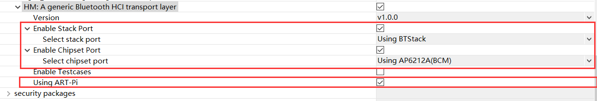
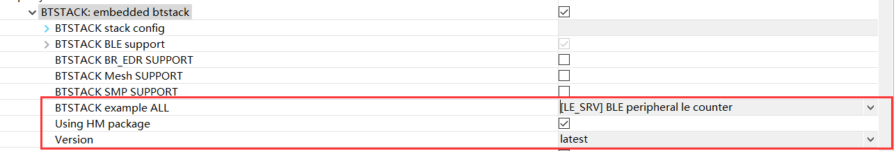
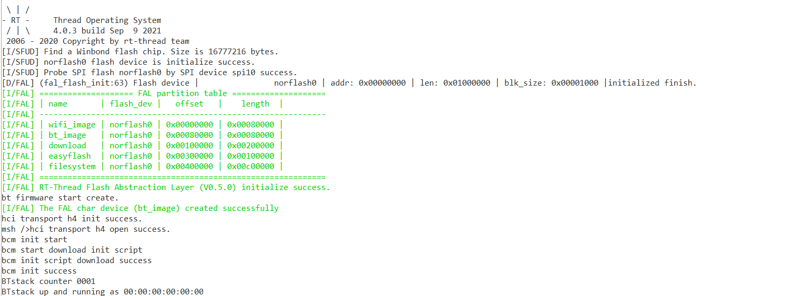

# HM

## 介绍

HM (HCI Middleware) 是一个蓝牙 HCI 传输层的中间件，目标是实现一个通用的 HCI Transport 组件，能够灵活的适配不同的蓝牙卡片，并且可以对接不同的蓝牙协议栈。详细内容可参考：[项目文档](https://hci-middleware.readthedocs.io/zh_CN/latest/)。

目前支持的蓝牙芯片：

- AP6212A (BCM)
- CSR8311
- Zephyr Controller

目前支持的蓝牙协议栈：

- BTStack
- NimBLE

### 目录结构

| 名称    | 说明                              |
| :------ | :-------------------------------- |
| docs    | 文档目录                          |
| include | 头文件目录                        |
| src     | 源文件目录                        |
| porting | 移植目录（蓝牙协议栈 + 蓝牙芯片） |
| tests   | 测试目录                          |

### 许可证

HM package 遵循 Apache-2.0 License 许可，详见 `LICENSE` 文件。

### 依赖

- Serial 设备驱动框架

## 如何打开 HM

使用 HM package 需要在 RT-Thread 的包管理器中选择它，具体路径如下：

```
RT-Thread online packages
	IoT packages --->
		[*] HM
```

## 如何使用 HM

HM 只是一个蓝牙 HCI Transport 层面的中间件，需要与蓝牙协议栈一起工作才能看到一个完整的效果，因此使用 HM 时还需要同时使用一款已经支持的蓝牙协议栈（BTStack, NimBLE），并且还需要选择使用的蓝牙芯片。

下面以 ART-Pi 为例介绍如何使用 HM 组件。

首先需要参考[文档教程](https://hci-middleware.readthedocs.io/zh_CN/latest/artpi_minimal_environment/)搭建 ART-Pi 蓝牙开发的最小环境，然后选中并配置 HM 软件包：

- 使用 **BTStack** 蓝牙协议栈
- 使用 **AP6212A** 蓝牙芯片
- 使用 **ART-Pi**



然后将 BTStack 软件包加入工程，选择 **LE Counter** 的例程，并**配置 BTStack 内部使用 HM 组件**：



编译下载代码，会有如下显示：



BTStack 成功运行。

## 注意事项

无

## 联系方式 & 感谢

- 维护：Jackistang
- 主页：https://github.com/Jackistang