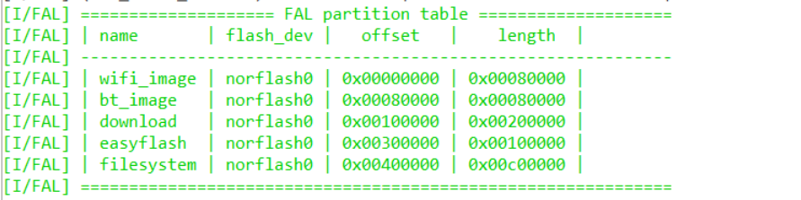
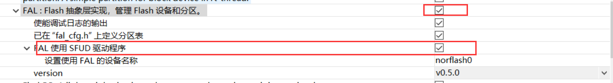
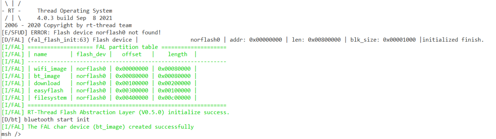

本篇文章介绍了如何利用 RT-Thread Studio 搭建 ART-Pi 蓝牙开发的最小环境。

ART-Pi 内部的蓝牙功能是通过 AP6212A 这个模组提供的，内部是 BCM 芯片。

首先创建一个 **art_pi_blink_led** 的示例工程，ART-Pi 在出厂时就已经将 AP6212A 的蓝牙固件烧写进了外部 Flash 里，若没有则需要参考[教程]()手动烧写。



使能硬件 SPI1：


添加 SFUD 组件， FAL 组件，勾选 **FAL 使用 SFUD 驱动程序**：



打开串口 3，并在 `board.h ` 文件里添加 Uart 3 的引进：


```c
#define BSP_USING_UART3
#define BSP_UART3_TX_PIN       "PB10"
#define BSP_UART3_RX_PIN       "PB11"
```


编译运行下载，能够看到下述输出：



