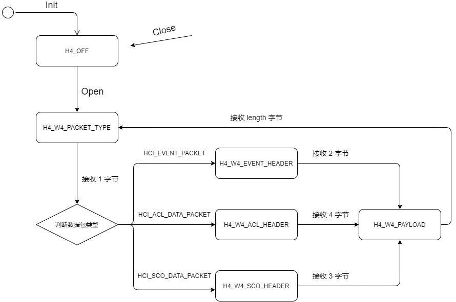

# BTStack

## BTStack 集成 HCI-Middleware

以 posix-h4-zephyr 环境为例，将 HCI-Middleware 整个项目复制到 btstack -> port -> posix-h4-zephyr 目录下，然后修改下面两个文件，

main.c 文件里更改头文件接口。


Makefile 文件里去除掉 hci_transport_h4.c 文件，并 include 文件 ./HCI-Middleware/porting/btstack/Makefile.inc 即可。


然后在 posix-h4-zephyr 直接执行 `make` 即成功集成 HCI-Middleware 。

## btstack HCI 数据接收流程

以 posix-h4-zephyr 移植环境为例，`btstack_uart_posix.c` 文件实现了 posix 环境下 btstack 定义的串口接口，`hci_transport_h4.c` 文件实现了 h4 的相关功能，下面先讨论 btstack 收发数据包的具体流程。

btstack 里的程序都处于一个大的 Loop 里，而且还允许里面的模块添加属于自己的小 Loop 。

以串口收发为例：

在串口打开函数 `btstack_uart_posix_open()` 里，有下述代码：

```C
// set up data_source
btstack_run_loop_set_data_source_fd(&transport_data_source, fd);
btstack_run_loop_set_data_source_handler(&transport_data_source, &hci_uart_posix_process);
btstack_run_loop_add_data_source(&transport_data_source);
```

这三行代码就为整个串口模块创建了一个 loop，然后这个 loop 就开始周期性地执行了。之后的串口发送函数 `btstack_uart_posix_send_block()` 和串口接收函数 `btstack_uart_posix_receive_block()` 只是简单地向 loop 里面添加了一个触发事件。

- 写操作的参数 `data` 是需要写入的数据缓冲区，`size` 是写入数据的大小。
- 读操作的参数 `buffer` 是读取数据的缓冲区，**`len` 是需要读取数据的大小（注意）**。

```C
static void btstack_uart_posix_send_block(const uint8_t *data, uint16_t size){
    // setup async write
    btstack_uart_block_write_bytes_data = data;
    btstack_uart_block_write_bytes_len  = size;
    btstack_run_loop_enable_data_source_callbacks(&transport_data_source, DATA_SOURCE_CALLBACK_WRITE);
}

static void btstack_uart_posix_receive_block(uint8_t *buffer, uint16_t len){
    btstack_uart_block_read_bytes_data = buffer;
    btstack_uart_block_read_bytes_len = len;
    btstack_run_loop_enable_data_source_callbacks(&transport_data_source, DATA_SOURCE_CALLBACK_READ);
}
```

现在来看看 loop 里执行的代码：

```C
static void hci_uart_posix_process(btstack_data_source_t *ds, btstack_data_source_callback_type_t callback_type) {
    if (ds->source.fd < 0) return;
    switch (callback_type){
        case DATA_SOURCE_CALLBACK_READ:
            {
                btstack_uart_block_posix_process_read(ds);
            }
            break;
        case DATA_SOURCE_CALLBACK_WRITE:
            {
                btstack_uart_block_posix_process_write(ds);
            }
            break;
        default:
            break;
    }
}
```

可以看见，根据 loop 的触发事件不同，我们进行相应的读写操作。

- 写操作比较简单，就是不断地向串口写入数据，如果一次没写完，就再触发一个写事件，在下次事件里继续写，直至写完，当然数据写完后还需要通知上层 HCI Transport，这是通过  `btstack_uart_posix_set_block_sent()` 函数注册的。
- 读操作也差不多，不断地从串口读取数据，直到所需的数据大小被读完，然后通知上层收到一个 HCI 数据包，这是通过 `btstack_uart_posix_set_block_received()` 函数注册的。

关键就在于这两个注册的函数，在 `hci_transport_h4.c` 文件里注册的是这两个函数 `hci_transport_h4_block_sent()` 和  `hci_transport_h4_block_read()` 。

**在 sent 函数里，通过 `packet_handler()` 函数给上层 HCI 传输了一个自定义事件 `6E 00`，代表 HCI 数据由 Host 成功发送给 Controller 。**该事件对于 btstack 十分重要，btstack 收到该事件后才会释放发送缓冲区。

```C
static void hci_transport_h4_block_sent(void){

    static const uint8_t packet_sent_event[] = { HCI_EVENT_TRANSPORT_PACKET_SENT, 0};

    switch (tx_state){
        case TX_W4_PACKET_SENT:
            // packet fully sent, reset state
            tx_state = TX_IDLE;
            // notify upper stack that it can send again
            packet_handler(HCI_EVENT_PACKET, (uint8_t *) &packet_sent_event[0], sizeof(packet_sent_event));
            break;
        default:
            break;
    }
}
```

在 read 函数里实现了一个收包的状态机，状态机图如下所示：



并且每次进入该函数，在最末尾都会调用 `hci_transport_h4_trigger_next_read()` 接口触发下一次的读操作，最终会激活串口模块里的读取事件，感兴趣地可以参考下述代码。

```C
static void hci_transport_h4_block_read(void){

    read_pos += bytes_to_read;

    switch (h4_state) {
        case H4_W4_PACKET_TYPE:
            switch (hci_packet[0]){
                case HCI_EVENT_PACKET:
                    bytes_to_read = HCI_EVENT_HEADER_SIZE;
                    h4_state = H4_W4_EVENT_HEADER;
                    break;
                case HCI_ACL_DATA_PACKET:
                    bytes_to_read = HCI_ACL_HEADER_SIZE;
                    h4_state = H4_W4_ACL_HEADER;
                    break;
                case HCI_SCO_DATA_PACKET:
                    bytes_to_read = HCI_SCO_HEADER_SIZE;
                    h4_state = H4_W4_SCO_HEADER;
                    break;
                default:
                    log_error("hci_transport_h4: invalid packet type 0x%02x", hci_packet[0]);
                    hci_transport_h4_reset_statemachine();
                    break;
            }
            break;
            
        case H4_W4_EVENT_HEADER:
            bytes_to_read = hci_packet[2];
            // check Event length
            if (bytes_to_read > (HCI_INCOMING_PACKET_BUFFER_SIZE - HCI_EVENT_HEADER_SIZE)){
                log_error("hci_transport_h4: invalid Event len %d - only space for %u", bytes_to_read, HCI_INCOMING_PACKET_BUFFER_SIZE - HCI_EVENT_HEADER_SIZE);
                hci_transport_h4_reset_statemachine();
                break;
            }
            h4_state = H4_W4_PAYLOAD;
            break;
            
        case H4_W4_ACL_HEADER:
            bytes_to_read = little_endian_read_16( hci_packet, 3);
            // check ACL length
            if (bytes_to_read > (HCI_INCOMING_PACKET_BUFFER_SIZE - HCI_ACL_HEADER_SIZE)){
                log_error("hci_transport_h4: invalid ACL payload len %d - only space for %u", bytes_to_read, HCI_INCOMING_PACKET_BUFFER_SIZE - HCI_ACL_HEADER_SIZE);
                hci_transport_h4_reset_statemachine();
                break;
            }
            h4_state = H4_W4_PAYLOAD;
            break;
            
        case H4_W4_SCO_HEADER:
            bytes_to_read = hci_packet[3];
            // check SCO length
            if (bytes_to_read > (HCI_INCOMING_PACKET_BUFFER_SIZE - HCI_SCO_HEADER_SIZE)){
                log_error("hci_transport_h4: invalid SCO payload len %d - only space for %u", bytes_to_read, HCI_INCOMING_PACKET_BUFFER_SIZE - HCI_SCO_HEADER_SIZE);
                hci_transport_h4_reset_statemachine();
                break;
            }
            h4_state = H4_W4_PAYLOAD;
            break;

        case H4_W4_PAYLOAD:
            hci_transport_h4_packet_complete();
            break;

        case H4_OFF:
            bytes_to_read = 0;
            break;
        default:
            btstack_assert(false);
            break; 
    }
    // forward packet if payload size == 0
    if (h4_state == H4_W4_PAYLOAD && bytes_to_read == 0u) {
        hci_transport_h4_packet_complete();
    }

    if (h4_state != H4_OFF) {
        hci_transport_h4_trigger_next_read();
    }
}
```

## btstack 芯片初始化

btstack 的 chipset 层比较简单，主要是用于 Reset 之后初始化蓝牙卡片，需要对接的核心接口为 `chipset_next_command()` 函数。

```C
static btstack_chipset_result_t chipset_next_command(uint8_t * hci_cmd_buffer);
```

该函数的功能是将一条 HCI 命令存储到 `hci_cmd_buffer` 所指向的缓冲区，如果初始化芯片需要发送多条 HCI 命令，这时返回 `BTSTACK_CHIPSET_VALID_COMMAND` 值，于是该函数会被再次调用，直至返回 `BTSTACK_CHIPSET_DONE` 。

以 Zephyr Controller 为例，其初始化命令为：

```C
static const uint8_t init_script[] = { 
    0x09, 0xfc, 0x00,
};
```

于是我们来看对接的 `chipset_next_command()` 函数：

```C
static uint32_t init_script_offset  = 0;

static btstack_chipset_result_t chipset_next_command(uint8_t * hci_cmd_buffer){

    while (true){

        if (init_script_offset >= init_script_size) {
            return BTSTACK_CHIPSET_DONE;
        }

        // copy command header
        memcpy(&hci_cmd_buffer[0], (uint8_t *) &init_script[init_script_offset], 3); 
        init_script_offset += 3;
        int payload_len = hci_cmd_buffer[2];
        // copy command payload
        memcpy(&hci_cmd_buffer[3], (uint8_t *) &init_script[init_script_offset], payload_len);

        return BTSTACK_CHIPSET_VALID_COMMAND;         
    }
}
```

它里面就是将 HCI 命令的 header 以及 payload 存入 `hci_cmd_buffer` 指向的缓冲区，然后返回 `BTSTACK_CHIPSET_VALID_COMMAND` 继续下一次发送，当发送完成后返回 `BTSTACK_CHIPSET_DONE` 表示初始化结束。

