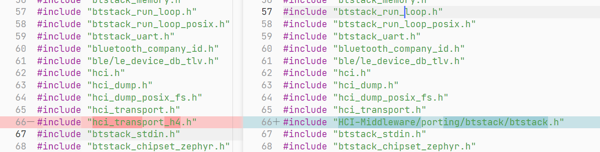
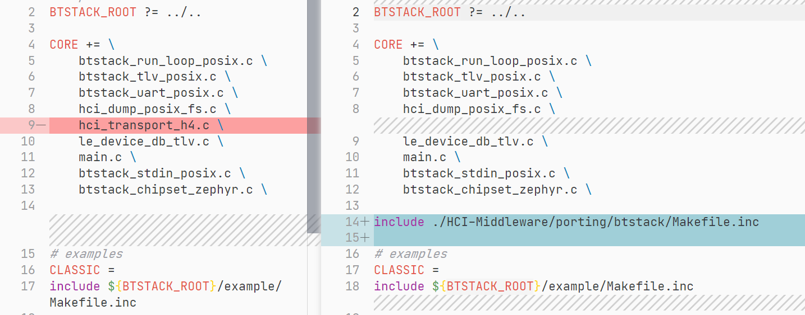

BTStack 通过自定义 HCI 事件 `HCI_EVENT_TRANSPORT_PACKET_SENT` 通知 HCI 当前数据已发送完毕，可以再次发送。完整的事件字节流为：`0x04 0x6E 0x00`，参考代码：

> hci_transport_h4.c -> hci_transport_h4_block_send() : 328 行

在 hci.c 中可以看见该事件用于 BTStack 内部使用：

```C
case HCI_EVENT_TRANSPORT_PACKET_SENT:
    // release packet buffer only for asynchronous transport and if there are not further fragements
    if (hci_transport_synchronous()) {
        log_error("Synchronous HCI Transport shouldn't send HCI_EVENT_TRANSPORT_PACKET_SENT");
        return; // instead of break: to avoid re-entering hci_run()
    }
    hci_stack->acl_fragmentation_tx_active = 0;
    if (hci_stack->acl_fragmentation_total_size) break;
    hci_release_packet_buffer();
    break;
```


## BTStack 构建规则

最开始运行的 makefile 在 BTStack 官方移植好的平台里，例如 port -> posix-h4-zephyr -> Makefile 。

以下都基于 posix-h4-zephyr 环境。

最开始创建了变量 `BTSTACK_ROOT` 用于指定 btstack 根目录，

```makefile
# Makefile for posix-h4 based examples
BTSTACK_ROOT ?= ../..
```


```
VPATH 
```


main.c 文件里更改头文件接口。



Makefile 文件里去除掉 hci_transport_h4.c 文件，并 include 文件 ./HCI-Middleware/porting/btstack/Makefile.inc 即可。

