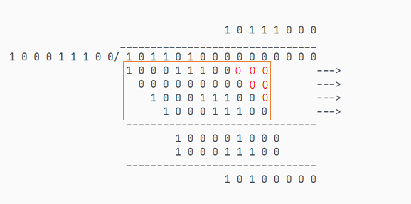

# CRC


## 驱动表的生成

在理解了驱动表算法的基础上，下一步就是如何生成这张表，下面我们假设 message = 1011 0100b ，poly = 1 0001 1100b ，驱动表索引为 4bit ，表内存储的数据为 8bit。

最开始索引为 1011b (11)，于是我们在驱动表内查找索引为 11 的数据，并将其和 0100 0000b 这之后的 8bit 消息异或，得到结果 1000 0100b，整个流程可以参考下图：



其实这整个运算可以看成消息 1011 0100 0000b 与矩形框内的所有数据异或（注意有补零操作），最终得到结果 1000 0100b。由于异或操作满足 `A^B^C = A^(B^C)`，我们可以先计算整个矩形框内的数据异或结果：1011 1100 0100b，观察可以看出，前 4 bit 就是驱动表索引，后 8 bit 就是驱动表内容，所以说驱动表法的核心是将多次运算存储成一张表，需要时直接查表，成倍地节省时间。 

具体代码如下：

```C
#define LUT_WIDTH   4
#define CRC_WIDTH   8
#define CRC_POLY    0x11C

for(index=0; index<(1<<LUT_WIDTH); index++){
    temp = 0;
    for(bit_cnt=LUT_WIDTH; bit_cnt>0; bit_cnt--){
        if((index>>(bit_cnt-1) ^ temp>>(CRC_WIDTH-1))&0x1)  
            temp = (temp<<1) ^ CRC_POLY;
        else                                                
            temp <<= 1;
    }
    table[index] = (unsigned char)temp;
}
```

`for(index=0; index<(1<<LUT_WIDTH); index++)` 遍历了所有的索引（0 - 255），`for(bit_cnt=LUT_WIDTH; bit_cnt>0; bit_cnt--)` 表示处理索引的每一个 bit，从高位开始，$[4, 3, 2, 1]$，`if((index>>(bit_cnt-1) ^ temp>>(CRC_WIDTH-1))&0x1)` 判断当前索引的当前 bit 是否为 1，若为 1 则与 poly 异或，否则跳过。最后去取 8 位结果存入驱动表。

如果不太能理解，手动模拟一遍就好了。

