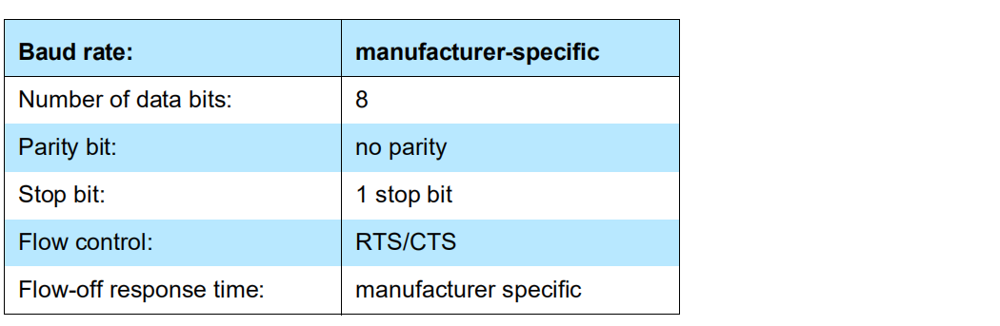

# HCI Transport

HCI Transport 是 Bluetooth 为了适配不同的硬件传输接口而定义的，例如 UART，SDIO 和 USB 。

## H4

H4 是在 UART 上定义的协议，较为简单，仅仅在 HCI 封包前添加一个字节代表该封包的类型。

传输数据格式如下：

| 1 byte  | N byte HCI raw data |
| :-----: | :-----------------: |
| H4 type |    HCI raw data     |

其中封包类型的值为：


H4 对于 UART 的配置有一定的要求：



注意此处使用了硬件流控 RTS/CTS：

- RTS（Ready to Send）：发送请求，为**输出**信号，用于**指示本设备准备好可接收数据**，低电平有效。
- CTS（Clear to Send）：发送运行，为**输入**信号，用于**判断是否可以向对端发送数据**，低电平有效。

H4 接口的接线参考下图：

| Host | Controller |
| :--: | :--------: |
| CTS  |    RTS     |
| RTS  |    CTS     |
|  RX  |     TX     |
|  TX  |     RX     |

因此当 Controller 准备好接收数据时，其 RTS 输出低电平，这样 Host 端的 CTS 就也为低电平，即 Host 可以向 Controller 发送数据。

当 Controller 和 Host 的通信发送错误时，只能通过 HCI Reset 命令来重启。

## H5

bit errors, overrun errors, burst errors.

基于连接的

在每个 HCI 包之前加一个头部，然后再将整个数据组合成 SLIP 协议的数据帧

**SLIP 将一个不可靠的数据流转换成不可靠的数据报流**，

头部字段用于标识数据报，并允许重传。

SLIP 将 0xC0 放置在数据报的起始处和末尾处，并将数据报内部的 0xC0 转义成 0xDB 0xDC，将数据报内部的 0xDB 转义成 0xDB 0xDD 。


## 接口

**BTStack：**

```C
typedef struct {
    const char * name;
    void   (*init) (const void *transport_config);
    int    (*open)(void);
    int    (*close)(void);
    void   (*register_packet_handler)(void (*handler)(uint8_t packet_type, uint8_t *packet, uint16_t size));
        /**
     * support async transport layers, e.g. IRQ driven without buffers
     */
    int    (*can_send_packet_now)(uint8_t packet_type);
    int    (*send_packet)(uint8_t packet_type, uint8_t *packet, int size);
    int    (*set_baudrate)(uint32_t baudrate);
    /**
     * extension for UART H5 on CSR: reset BCSP/H5 Link
     */
    void   (*reset_link)(void);
    /**
     * extension for USB transport implementations: config SCO connections
     */
    void   (*set_sco_config)(uint16_t voice_setting, int num_connections);
} hci_transport_t;
```

用 `init()` 初始化传输层，`open()` 和 `close()` 分别打开关闭传输层。`send_packet()` 发送 HCI 包，`can_send_packet_now()` 用于支持异步传输，例如我调用 `send_packet()` 将 HCI 包放到 DMA 缓冲区等待传输，传输时调用 `can_send_packet_now()` 返回 false，这样就可以避免破坏 DMA 缓冲区，造成数据传输混乱，当传输完成后，再调用 `can_send_packet_now()` 返回 true，表示可以继续传输。`register_packet_handler()` 函数注册接收回调函数，传输层还支持直接修改波特率 `set_baudrate()` 。

H5 接口额外支持 `reset_link()`，USB 额外接口支持 `set_sco_config()` 。


**Zephyr：**

```C
struct bt_hci_driver {
	const char *name;
	enum bt_hci_driver_bus bus;
	uint32_t quirks;
	int (*open)(void);
	int (*send)(struct net_buf *buf);
};
```

`open()` 用于打开 HCI Transport，并创建线程接收数据，`send()` 用于发送数据（中断发送）,在创建的线程里接收数据后调用 `bt_recv()` 将数据通过消息队列传递给 HCI 线程。

表驱动处理事件。


**NimBLE:**

Host HCI Transport 接口：

```C
int ble_hci_trans_hs_cmd_tx(uint8_t *cmd);
int ble_hci_trans_hs_acl_tx(struct os_mbuf *om);
void ble_hci_trans_cfg_hs(ble_hci_trans_rx_cmd_fn *cmd_cb,
                          void *cmd_arg,
                          ble_hci_trans_rx_acl_fn *acl_cb,
                          void *acl_arg);

uint8_t *ble_hci_trans_buf_alloc(int type);
void ble_hci_trans_buf_free(uint8_t *buf);
int ble_hci_trans_set_acl_free_cb(os_mempool_put_fn *cb, void *arg);

int ble_hci_trans_reset(void);
```

该接口在 `ble_hci_trans.h` 文件里。 

由于 NimBLE 同时支持 Controller 和 Host，上述只列出了与 Host 相关的 HCI Transport 接口。

- `ble_hci_trans_hs_cmd_tx()` 函数用于发送 HCI 命令，`cmd` 内存是由 `ble_hci_trans_buf_alloc()` 申请的，并且该函数负责释放这片空间？
- `ble_hci_trans_hs_acl_tx()` 函数用于发送 ACL 数据，数据格式为 NimBLE 定义的 `struct os_mbuf` 。
- `ble_hci_trans_cfg_hs()` 注册 Event 事件接收回调函数，和 ACL 数据接收回调函数。

- `ble_hci_trans_buf_alloc()` 根据参数 type 分配相应的内存空间，自定义的。
- `ble_hci_trans_buf_free()` 释放分配的内存空间。
- `ble_hci_trans_set_acl_free_cb()` 注册 ACL 数据释放的回调函数，（不太懂）
- `ble_hci_trans_reset()` 复位传输层。


从目前调研结果可知，共有两种类型的接口：

1. 类似 BTStack、NimBLE 这种，提供通用的 HCI Transport 供实现，移植目标较为明确。
2. 类似 Zephyr 这种，提供了一些 HCI Transport 接口，需要我们在收发包的时候调用这些接口，对接该类协议栈需要先研究其 HCI Transport 如何实现，较为麻烦。

