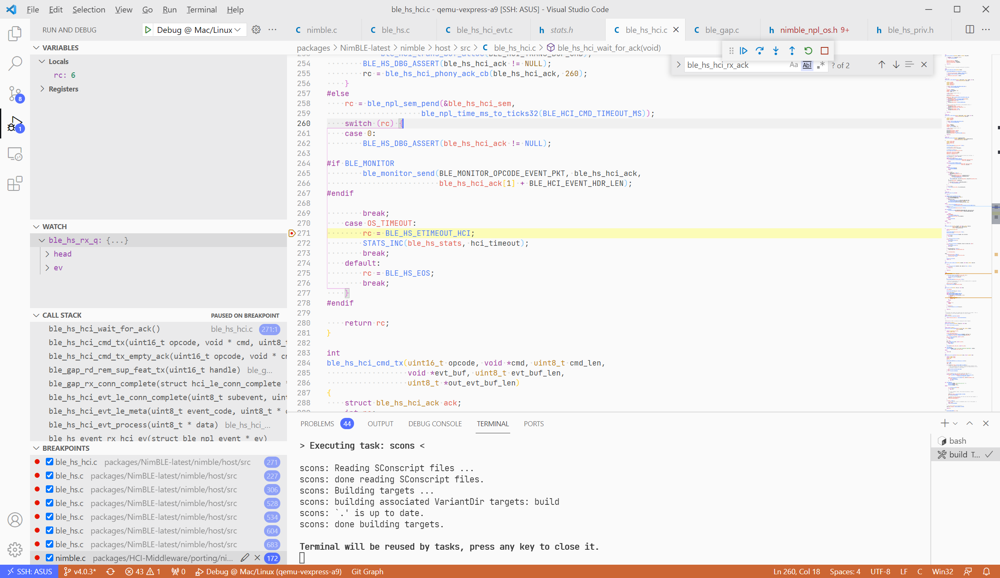
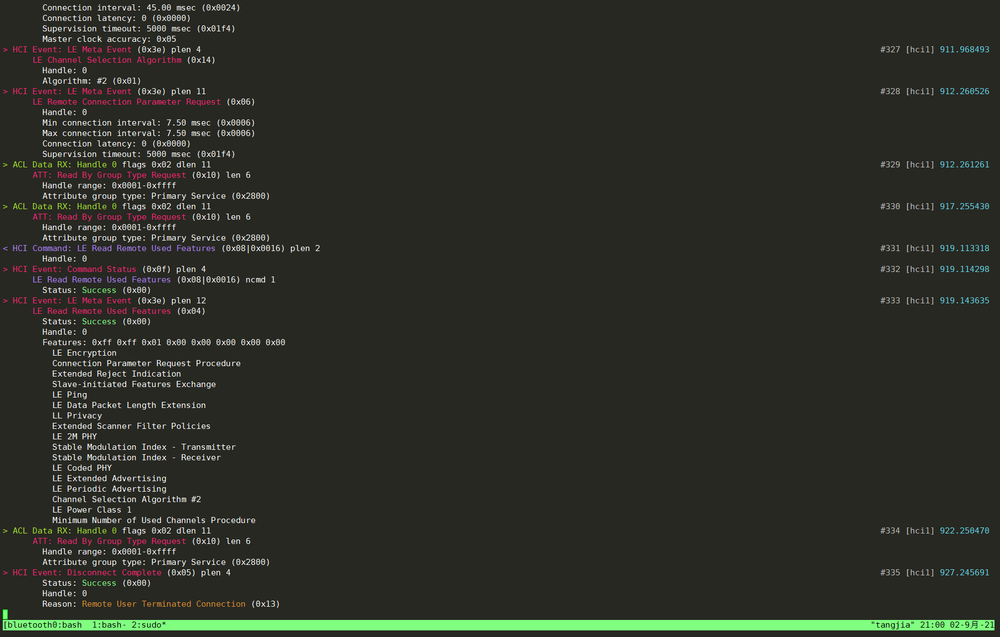

建立连接时，接收一个 ACL 包后再发送 Command 并等待 Event 数据包无响应，然后超时。

Command: LE Read Remote Used Features

Event: Command Status, LE Read Remote Used Features






在 apps 里的 `ble*_on_sync()` 函数中加上：

```C
uint8_t random_addr[6] = {0x11, 0x22, 0x33, 0x44, 0x55, 0x06};
ble_hs_id_set_rnd(random_addr);
```


选用最新版的 NimBLE，NimBLE Controller 要关掉。