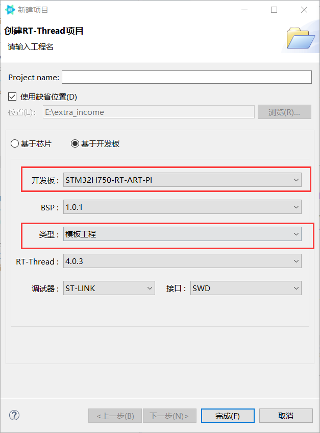
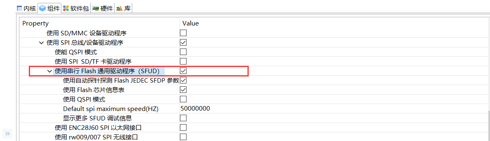
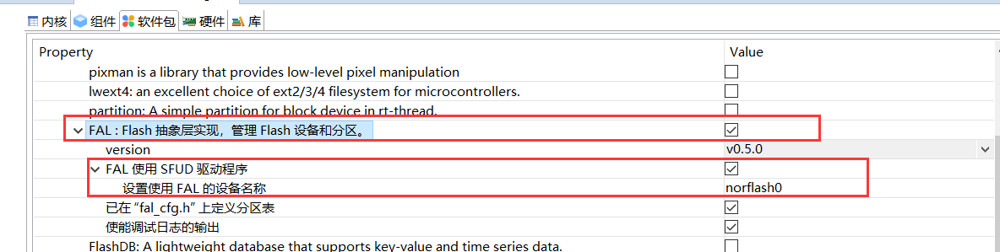
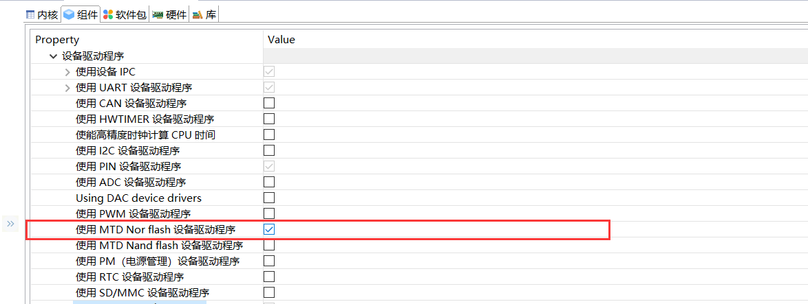
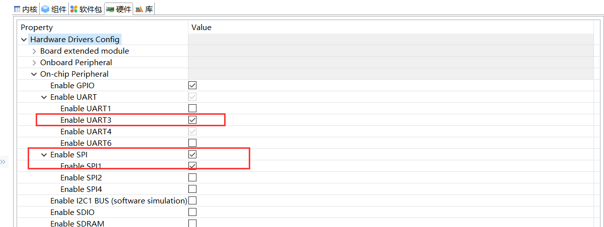

本篇文章介绍了如何利用 RT-Thread Studio 搭建 ART-Pi 蓝牙开发的最小环境。

ART-Pi 内部的蓝牙功能是通过 AP6212A 这个模组提供的，内部是 BCM 芯片。

首先创建一个基于 ART-Pi BSP 的**模板工程**，



最终需要在 `rtconfig.h` 里添加下述内容：

```c
#define RT_USING_MTD_NOR

#define RT_USING_SFUD
#define RT_SFUD_USING_SFDP
#define RT_SFUD_USING_FLASH_INFO_TABLE
#define RT_SFUD_SPI_MAX_HZ 50000000

#define PKG_USING_FAL
#define FAL_DEBUG_CONFIG
#define FAL_DEBUG 1
#define FAL_PART_HAS_TABLE_CFG
#define FAL_USING_SFUD_PORT
#define FAL_USING_NOR_FLASH_DEV_NAME "norflash0"
#define PKG_USING_FAL_V00500
#define PKG_FAL_VER_NUM 0x00500

#define BSP_USING_UART3
#define BSP_USING_SPI
#define BSP_USING_SPI1
```

上述这些配置项主要是将外部 Flash 里存储的蓝牙固件挂载为 `"/dev/bt_image"`，下面依次介绍如何添加这些配置项：

打开 SFUD：



添加 FAL 组件，并选中 **FAL 使用 SFUD 驱动程序**：



还需要开启 **使用 MTD Nor flash 设备驱动程序**：



选中 SPI1，和 UART3 。SPI1 是用来驱动外部 Flash 的，而 UART3 用于和蓝牙模组 AP6212A 通信。



在 `board.h` 文件里添加 UART3 使用的引脚：

```c
#define BSP_USING_UART3
#define BSP_UART3_TX_PIN       "PB10"
#define BSP_UART3_RX_PIN       "PB11"
```

这样，ART-Pi 蓝牙开发的最小环境就配置完成了。

----

**注意：**ART-Pi 在出厂时就已经将 AP6212A 的蓝牙固件烧写进了外部 Flash 里，若没有则需要参考[教程](https://github.com/RT-Thread-Studio/sdk-bsp-stm32h750-realthread-artpi/blob/master/documents/UM5003-RT-Thread%20ART-Pi%20BT_WIFI%20%E6%A8%A1%E5%9D%97%E5%9B%BA%E4%BB%B6%E4%B8%8B%E8%BD%BD%E6%89%8B%E5%86%8C.md)手动烧写。


