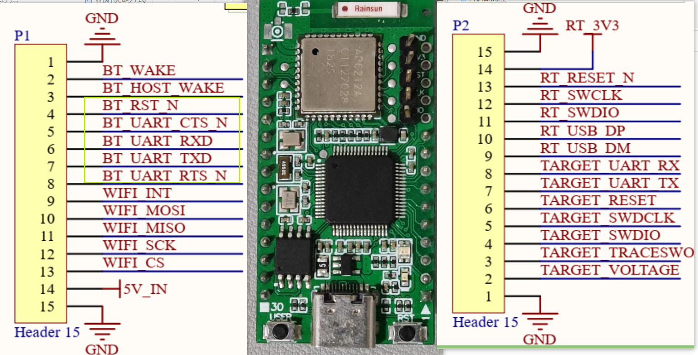
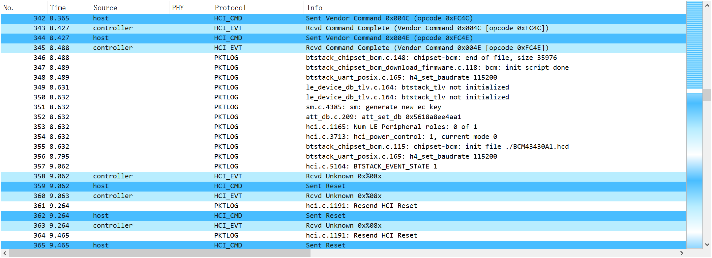

我测试用的 AP6212A 蓝牙卡片如下：

测试时需要接上

- BT_RST_N
- BT_UART_CTS_N
- BT_UART_RXD
- BT_UART_TXD
- BT_UART_RTS_N
- GND
- RT_3V3

启动 AP6212A 时，需要先将 `BT_RST_N` **拉低**，然后再**拉高**并保持，这样发送 HCI 命令才会有响应。

> 该 AP6212A 内核 43438 默认只允许发送 HCI Reset，btstack 里对于通用的 BCM 一般发送 HCI Reset 之后会读 local version，然后再下载 hcd 文件初始化蓝牙卡片。但这不适用 43438，需要注意。

BCM 蓝牙卡片初始化流程如下：

1. 首先发送 HCI 命令 `0x00 0x2e 0xfc 0x00` ，表示准备下载 hcd 文件。
2. 打开 [BCM43430A1.hcd](https://github.com/OpenELEC/misc-firmware/raw/master/firmware/brcm/BCM43430A1.hcd) 文件，里面存储着一条条 HCI 命令，每次取出一条 HCI 命令并发送，直至发送完毕。

初始化的 HCI 包为 `packages/bcm.pklg` ，可以通过 Wireshark 打开。

hcd 固件下载完成后，再发送 HCI Reset 命令无响应。

