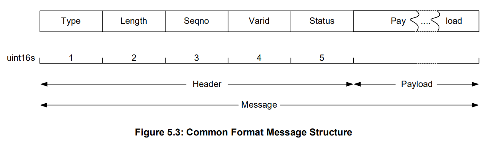
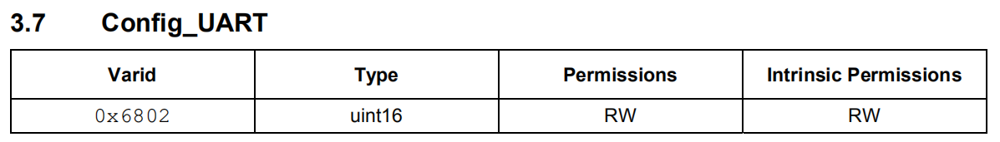
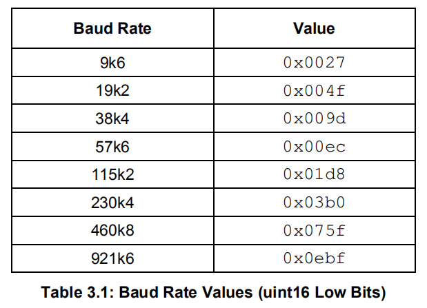
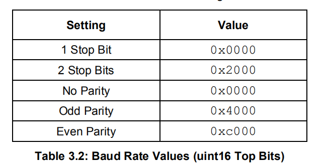

我测试用的 CSR8311 开发板如下：


测试时需要接上

- 5V
- GND
- RX
- TX
- RTS
- CTS

注意此开发板的接口设计比较奇怪，用 USB 转串口工具去接线时，不需要反接，也就是：

- RX -RX
- TX - TX
- RTS - RTS
- CTS - CTS

接好线后，CSR8311 就有一个波特率为 115200 的 H4 Transport 接口，可以在 BTstack 里已有的移植环境 [BTstack Port for POSIX Systems with H4 Bluetooth Controller](http://bluekitchen-gmbh.com/btstack/#ports/existing_ports/#btstack-port-for-posix-systems-with-h4-bluetooth-controller) 里直接运行。

CSR8311 初始化流程如下，发送一个数组内存储的 HCI 命令：

```C
// minimal CSR init script to configure PSKEYs and activate them. It uses store 0x0008 = psram.
static const uint8_t init_script[] = { 
    // 0x01fe: Set ANA_Freq to 26MHz
    0x00, 0xFC, 0x13, 0xc2, 0x02, 0x00, 0x09, 0x00, 0x01, 0x00, 0x03, 0x70, 0x00, 0x00, 0xfe, 0x01, 0x01, 0x00, 0x08, 0x00, 0x90, 0x65,
    // 0x00f2: Set HCI_NOP_DISABLE
    0x00, 0xFC, 0x13, 0xc2, 0x02, 0x00, 0x09, 0x00, 0x01, 0x00, 0x03, 0x70, 0x00, 0x00, 0xf2, 0x00, 0x01, 0x00, 0x08, 0x00, 0x01, 0x00,
    // 0x01bf: Enable RTS/CTS for BCSP (0806 -> 080e)
    0x00, 0xFC, 0x13, 0xc2, 0x02, 0x00, 0x09, 0x00, 0x01, 0x00, 0x03, 0x70, 0x00, 0x00, 0xbf, 0x01, 0x01, 0x00, 0x08, 0x00, 0x0e, 0x08,
    // 0x01ea: Set UART baudrate to 115200
    0x00, 0xFC, 0x15, 0xc2, 0x02, 0x00, 0x0a, 0x00, 0x02, 0x00, 0x03, 0x70, 0x00, 0x00, 0xea, 0x01, 0x02, 0x00, 0x08, 0x00, 0x01, 0x00, 0x00, 0xc2,
    // 0x0001: Set Bluetooth address 
    0x00, 0xFC, 0x19, 0xc2, 0x02, 0x00, 0x0A, 0x00, 0x03, 0x00, 0x03, 0x70, 0x00, 0x00, 0x01, 0x00, 0x04, 0x00, 0x08, 0x00, 0xf3, 0x00, 0xf5, 0xf4, 0xf2, 0x00, 0xf2, 0xf1,
    //  WarmReset
    0x00, 0xFC, 0x13, 0xc2, 0x02, 0x00, 0x09, 0x00, 0x03, 0x0e, 0x02, 0x40, 0x00, 0x00, 0x00, 0x00, 0x00, 0x00, 0x08, 0x00, 0x00, 0x00,
};
```

> 每条命令的长度都为 0xc2，可能需要在末尾填充 0  ？

初始化的 HCI 包为 `packages/csr8311.pklg` ，可以通过 Wireshark 打开。


> CSR chipset do not require an actual init script in general, but they allow to configure the chipset via so-called PSKEYs. After setting one or more PSKEYs, a warm reset activates the new setting.
>
> **BD Addr** can be set via PSKEY. A fixed address can be provided if the chipset has some kind of persistent memory to store it. Most USB Bluetooth dongles have a fixed BD ADDR.
>
> **SCO data** can be configured via a set of PSKEYs. We haven't been able to route SCO data over HCI for UART connections yet.
>
> **Baud rate** can be set as part of the initial configuration and gets actived by the warm reset.


bluez/tools/hciattach.c : csr() 函数里有 CSR 的初始化代码。

`/* 10 seconds should be enough for initialization */`

```
Read CSR chip build ID:
01 00 fc 17 c2 00 00 09 00 00 00 19 28 00 00 00 00 00 00 00 00 00 00 00 00 00 00
build ID: resp[15] - resp[14]

Read CSR chip current baudrate:
01 00 fc 13 c2 00 00 09 00 01 00 02 68 00 00 00 00 00 00 00 00 00 00

Set CSR chip baudrate:
01 00 fc 13 c2 02 00 09 00 02 00 xx xx 00 00 00 00 00 00 00 00 00 00

```





CSR Vendor Read BuildID Command 等同于 HCI Command Read_Local_Version_Information 。


warm reset 在上电状态（warm）下强行复位芯片，使之前的配置信息生效（例如更改的波特率），该命令不会有 RSP 返回。




该命令大部分时间会返回 RSP

低 13 位用于配置波特率：


$$
Value = (baudrate / 244.140625)
$$
Bluez 里用的公式为:
$$
(baudrate * 64 + 7812) / 15625;
$$
高三位用于配置停止位和奇偶校验，一般都是 0 。




CSR8311 成功初始化：

