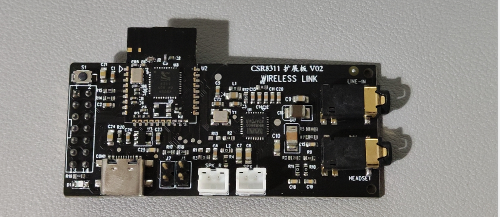
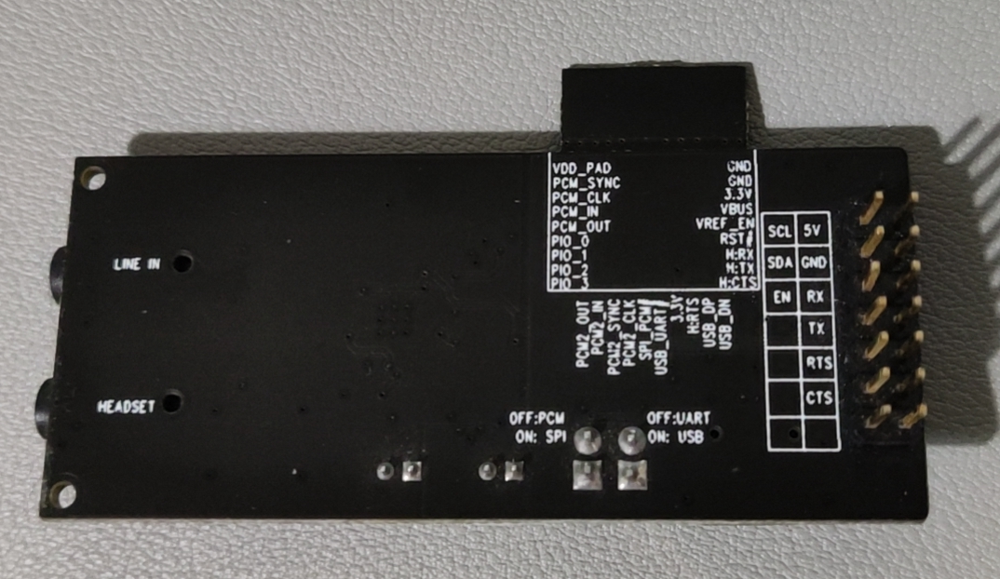

我测试用的 CSR8311 开发板如下：





测试时需要接上

- 5V
- GND
- RX
- TX
- RTS
- CTS

注意此开发板的接口设计比较奇怪，用 USB 转串口工具去接线时，不需要反接，也就是：

- RX -RX
- TX - TX
- RTS - RTS
- CTS - CTS

接好线后，CSR8311 就有一个波特率为 115200 的 H4 Transport 接口，可以在 BTstack 里已有的移植环境 [BTstack Port for POSIX Systems with H4 Bluetooth Controller](http://bluekitchen-gmbh.com/btstack/#ports/existing_ports/#btstack-port-for-posix-systems-with-h4-bluetooth-controller) 里直接运行。

CSR8311 初始化流程如下，发送一个数组内存储的 HCI 命令：

```C
// minimal CSR init script to configure PSKEYs and activate them. It uses store 0x0008 = psram.
static const uint8_t init_script[] = { 
    // 0x01fe: Set ANA_Freq to 26MHz
    0x00, 0xFC, 0x13, 0xc2, 0x02, 0x00, 0x09, 0x00, 0x01, 0x00, 0x03, 0x70, 0x00, 0x00, 0xfe, 0x01, 0x01, 0x00, 0x08, 0x00, 0x90, 0x65,
    // 0x00f2: Set HCI_NOP_DISABLE
    0x00, 0xFC, 0x13, 0xc2, 0x02, 0x00, 0x09, 0x00, 0x01, 0x00, 0x03, 0x70, 0x00, 0x00, 0xf2, 0x00, 0x01, 0x00, 0x08, 0x00, 0x01, 0x00,
    // 0x01bf: Enable RTS/CTS for BCSP (0806 -> 080e)
    0x00, 0xFC, 0x13, 0xc2, 0x02, 0x00, 0x09, 0x00, 0x01, 0x00, 0x03, 0x70, 0x00, 0x00, 0xbf, 0x01, 0x01, 0x00, 0x08, 0x00, 0x0e, 0x08,
    // 0x01ea: Set UART baudrate to 115200
    0x00, 0xFC, 0x15, 0xc2, 0x02, 0x00, 0x0a, 0x00, 0x02, 0x00, 0x03, 0x70, 0x00, 0x00, 0xea, 0x01, 0x02, 0x00, 0x08, 0x00, 0x01, 0x00, 0x00, 0xc2,
    // 0x0001: Set Bluetooth address 
    0x00, 0xFC, 0x19, 0xc2, 0x02, 0x00, 0x0A, 0x00, 0x03, 0x00, 0x03, 0x70, 0x00, 0x00, 0x01, 0x00, 0x04, 0x00, 0x08, 0x00, 0xf3, 0x00, 0xf5, 0xf4, 0xf2, 0x00, 0xf2, 0xf1,
    //  WarmReset
    0x00, 0xFC, 0x13, 0xc2, 0x02, 0x00, 0x09, 0x00, 0x03, 0x0e, 0x02, 0x40, 0x00, 0x00, 0x00, 0x00, 0x00, 0x00, 0x08, 0x00, 0x00, 0x00,
};
```

> 每条命令的长度都为 0xc2，可能需要在末尾填充 0  ？

初始化的 HCI 包为 `packages/csr8311.pklg` ，可以通过 Wireshark 打开。