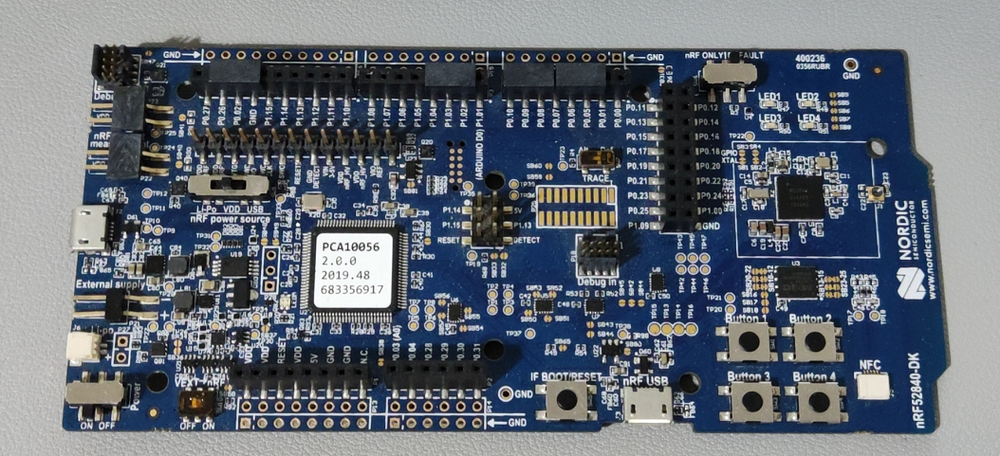

## BCM

目前市面上 AP 系列的模组内部使用了 BCM 芯片，我测试用的是 AP6212A 蓝牙卡片模组，内部为 BCM43430A1 芯片。

BCM43430A1 芯片初始化需要一个专门的初始化文件 [BCM43430A1.hcd](https://github.com/OpenELEC/misc-firmware/raw/master/firmware/brcm/BCM43430A1.hcd)，里面存储的都是 HCI 命令。因此 BCM43430A1 芯片初始化流程为：

- 首先发送 HCI 命令 `0x00 0x2e 0xfc 0x00` ，表示准备下载 hcd 文件。
- 打开 [BCM43430A1.hcd](https://github.com/OpenELEC/misc-firmware/raw/master/firmware/brcm/BCM43430A1.hcd) 文件，里面存储着一条条 HCI 命令，每次取出一条 HCI 命令并发送，直至发送完毕。

我测试所使用的开发板如下：


测试时需要接上

- BT_RST_N
- BT_UART_CTS_N
- BT_UART_RXD
- BT_UART_TXD
- BT_UART_RTS_N
- GND
- RT_3V3

启动 AP6212A 时，需要先将 `BT_RST_N` **拉低**，然后再**拉高**并保持，这样发送 HCI 命令才会有响应。

## Zephyr Controller

Zephyr Controller 是指利用 Zephyr RTOS 官方例程 [Bluetooth: HCI UART](https://docs.zephyrproject.org/latest/samples/bluetooth/hci_uart/README.html) 实现的 H4 接口蓝牙控制器，波特率为 1000000 。

Zephyr Controller 初始化流程比较简单，发送一条命令即可：

```
0x00 0x09 0xfc 0x00
```

我测试 Zephyr Controller 用的开发板为 nRF52840DK ：



## CSR8311

CSR8311 蓝牙卡片的初始化比较直接，直接发送命令接口，命令数组如下：

```C
static uint8_t download_commands[] = {
    // 0x01fe: Set ANA_Freq to 26MHz
    0x00, 0xFC, 0x13, 0xc2, 0x02, 0x00, 0x09, 0x00, 0x01, 0x00, 0x03, 0x70, 0x00, 0x00, 0xfe, 0x01, 0x01, 0x00, 0x08, 0x00, 0x90, 0x65,
    // 0x00f2: Set HCI_NOP_DISABLE
    0x00, 0xFC, 0x13, 0xc2, 0x02, 0x00, 0x09, 0x00, 0x01, 0x00, 0x03, 0x70, 0x00, 0x00, 0xf2, 0x00, 0x01, 0x00, 0x08, 0x00, 0x01, 0x00,
    // 0x01bf: Enable RTS/CTS for BCSP (0806 -> 080e)
    0x00, 0xFC, 0x13, 0xc2, 0x02, 0x00, 0x09, 0x00, 0x01, 0x00, 0x03, 0x70, 0x00, 0x00, 0xbf, 0x01, 0x01, 0x00, 0x08, 0x00, 0x0e, 0x08,
    // 0x01ea: Set UART baudrate to 115200
    0x00, 0xFC, 0x15, 0xc2, 0x02, 0x00, 0x0a, 0x00, 0x02, 0x00, 0x03, 0x70, 0x00, 0x00, 0xea, 0x01, 0x02, 0x00, 0x08, 0x00, 0x01, 0x00, 0x00, 0xc2,
    // 0x0001: Set Bluetooth address 
    0x00, 0xFC, 0x19, 0xc2, 0x02, 0x00, 0x0A, 0x00, 0x03, 0x00, 0x03, 0x70, 0x00, 0x00, 0x01, 0x00, 0x04, 0x00, 0x08, 0x00, 0xf3, 0x00, 0xf5, 0xf4, 0xf2, 0x00, 0xf2, 0xf1,
    //  WarmReset Command
    0x00, 0xFC, 0x13, 0xc2, 0x02, 0x00, 0x09, 0x00, 0x03, 0x0e, 0x02, 0x40, 0x00, 0x00, 0x00, 0x00, 0x00, 0x00, 0x08, 0x00, 0x00, 0x00,
};
```

我测试用的 CSR8311 开发板如下：


测试时需要接上

- 5V
- GND
- RX
- TX
- RTS
- CTS

注意此开发板的接口设计比较奇怪，用 USB 转串口工具去接线时，不需要反接，也就是：

- RX -RX
- TX - TX
- RTS - RTS
- CTS - CTS

接好线后，CSR8311 就有一个波特率为 115200 的 H4 Transport 接口。
