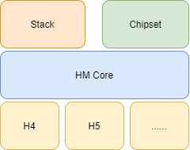
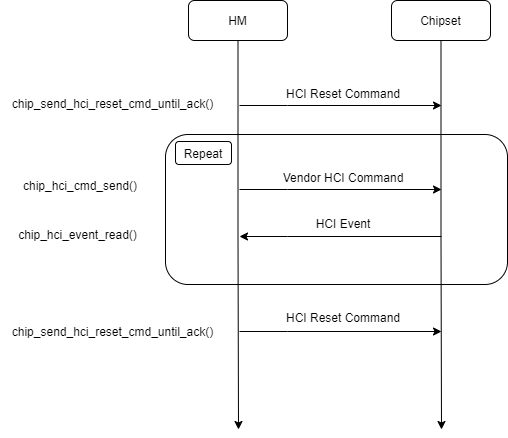

## HM 简介

HM (HCI Middleware) 是一个蓝牙 HCI 层面的中间件，它是[开源软件供应链点亮计划 - 暑期2021][1]里的一个项目，最终目标是实现一个通用的 HCI Transport 组件，能够灵活的适配不同的蓝牙卡片，并且可以对接不同的蓝牙协议栈。其架构如下图所示：



**HM Core** 是整个组件的核心，它基于 RT-Thread 的设备框架实现蓝牙 HCI Transport 的功能，目前仅支持 H4 接口，后续会支持 H5、USB、SDIO 等接口。

**Stack** 则是对接蓝牙协议栈的模块，其利用 HM Core 提供的接口实现了不同蓝牙协议栈的 HCI Transport 功能，从而能够使用不同的协议栈。

**Chipset** 是与具体蓝牙卡片相关的模块，Chipset 模块实现了一套注册框架，根据使用的蓝牙卡片，选择相对应的 Chipset 对象注册，从而能够灵活地选择蓝牙卡片。目前已支持 Zephyr Controller，BCM，CSR8311 。

## Chipset 注册

注册一个新的蓝牙卡片比较简单，实现一个 `hm_chipset_t` 结构体，并将该结构体指针通过 `hm_chipset_get_instance()` 函数返回即可：

```C
typedef struct hm_chipset {
    char *name;
    int (*init)(void);
} hm_chipset_t;

extern hm_chipset_t* hm_chipset_get_instance(void);
```

Chipset 结构体里的 `init()` 函数用于初始蓝牙卡片，通常都是发送 Vendor HCI Command，目前已提供接口：

```C
extern int chip_hci_cmd_send(uint8_t *buf, uint16_t size);
extern int chip_hci_event_read(uint8_t *buf, uint16_t size, int ms);
extern void chip_send_hci_reset_cmd_until_ack(void);
```

蓝牙卡片初始化的流程一般如下图所示：



先利用函数 `chip_send_hci_reset_cmd_until_ack()` 不断地向蓝牙卡片发送 HCI Reset Command，直到蓝牙卡片回复；然后通过接口 `chip_hci_cmd_send()` 向蓝牙卡片发送 Vendor HCI Command 初始化卡片，再利用接口 `chip_hci_event_read()` 获取蓝牙卡片返回的 HCI Event，判断 HCI 命令是否发送成功。重复这一过程，直到所有的初始化 HCI 命令发送完毕；最后再次调用 `chip_send_hci_reset_cmd_until_ack()` 接口复位蓝牙卡片。

以 Zephyr Controller 蓝牙卡片为例：

```C
static uint8_t init_commands[] = {
    // OGF: 0x3F, OCF: 0x09, Paramter Total Length: 0x00. 
    // Zephyr Controller 
    0x09, 0xfc, 0x00, 
};
int chipset_zephyr_init(void)
{
    uint8_t event_buf[20];
    chip_send_hci_reset_cmd_until_ack();
    rt_kprintf("Zephyr controller start init\n");

    chip_hci_cmd_send(init_commands, ARRAY_SIZE(init_commands));
    chip_hci_event_read(event_buf, ARRAY_SIZE(event_buf), RT_WAITING_FOREVER);
    if (event_buf[0] != 0x0E) {
        rt_kprintf("Zephyr controller init fail\n");
        return HM_CHIPSET_INIT_ERROR;
    }

    chip_send_hci_reset_cmd_until_ack();

    rt_kprintf("Zephyr controller init success\n");
    return HM_SUCCESS;
}
```

**注意：**目前 Chipset 层尚不支持动态切换蓝牙卡片，切换蓝牙卡片需要重新编译内核。

---

参考：

[1]: https://summer.iscas.ac.cn/#/homepage	"暑期2021"