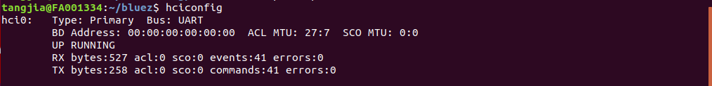
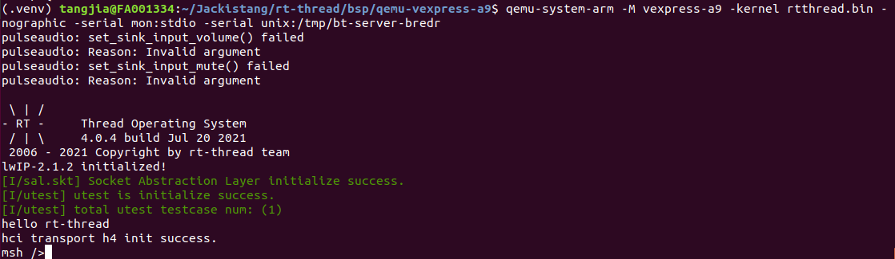
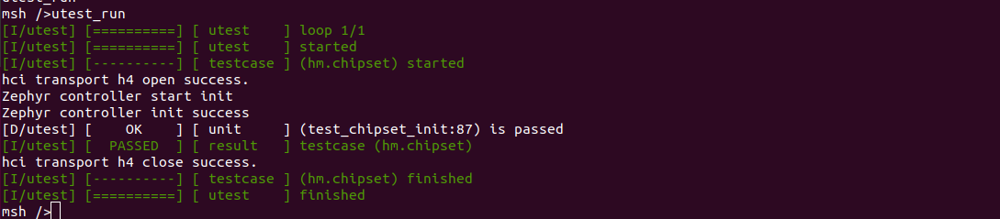
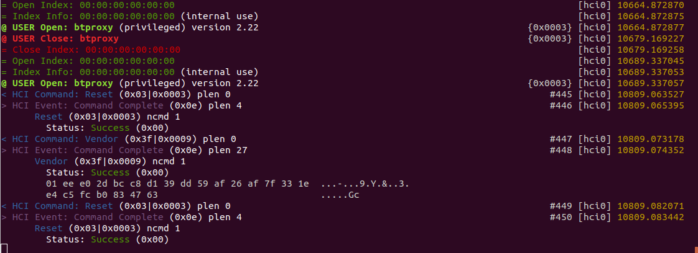

# RT-Thread qemu 环境运行 BLE

最近在基于 RT-Thread 环境开发 BLE，觉得每次都需要烧录代码到开发板太麻烦了，想利用 RT-Thread 的 qemu 环境开发 BLE 应用，于是我想起了之前使用 Zephyr 时，它提供的 qemu 环境能够直接访问物理机上的 Bluetooth Controller，也就是说，qemu 环境里运行 Bluetooth Host，能够直接发送 HCI 命令给 Controller，从而达到在 qemu 环境里运行 BLE 应用的目的。

并且这种 qemu Host + 物理机 Controller 的模式，能够直接使用物理机自带的蓝牙控制器，也可以接入外部的蓝牙卡片充当控制器，十分灵活。下面介绍如何在 RT-Thread 的 qemu 环境里接入 Bluetooth Controller 。

## 环境安装

这里的环境安装主要是编译 bluez 的源码，因为实现该功能需要 bluez 提供的工具 **btattach**，**btproxy**，**btmon**，一般系统自带的 bluez 并未编译这些工具，所以最好自己编译 bluez 的源码。如何编译 bluez 的源码，可以参考我之前的文章 [Zephyr - Bluetooth 环境搭建 - QEMU 篇](https://www.jianshu.com/p/6d86f879639a)。

## btproxy 配置

首先需要确定物理机内拥有 Bluetooth Controller，如何利用外接的蓝牙卡片充当 Controller 在以后的文章里介绍，在命令行输入 `hciconfig` ，一般会有下述信息显示：



这就代表系统内有了 `hci0` 这个设备。

之后**关闭 Controller**，再利用 **btproxy** 工具创建一个 Bluetooth Controller 的代理（proxy），命令如下：

```shell
tangjia@FA001334:~/bluez$ sudo systemctl stop bluetooth
tangjia@FA001334:~/bluez$ sudo tools/btproxy -u -i 0
```

其中 `-u` 代表使用 Unix Server，默认路径为 `/tmp/bt-server-bredr`，`-i 0` 代表使用 `hci0` 设备。上述命令执行完后应该会有下述显示：


说明 btproxy 把 hci0 设备和 /tmp/bt-server-bredr 设备之间建立了联系，其他程序可以通过 /tmp/bt-server-bredr 这个设备访问 hci0 设备，从而访问 Bluetooth Controller 。

## qemu 配置

目前在 R 的 qemu-vexpress-a9 环境里，运行 qemu 程序的命令为：

```shell
qemu-system-arm -M vexpress-a9 -kernel rtthread.bin -serial stdio -sd sd.bin
```

只需要更改执行命令为：

```shell
qemu-system-arm -M vexpress-a9 -kernel rtthread.bin -serial stdio -sd sd.bin -serial mon:stdio -serial unix:/tmp/bt-server-bredr
```

即可成功在 qemu 环境里与 Bluetooth Controller 交互，下面稍微介绍下原理和注意事项。

新增加的 qemu 命令参数为 `-serial mon:stdio -serial unix:/tmp/bt-server-bredr`，`-serial` 参数的介绍为：

> -serial dev     redirect the serial port to char device 'dev'

这个参数将 qemu 程序的串口重定向到物理机的设备文件，

第一个`-serial mon:stdio` 将 qemu 里的 uart0 重定向到了物理机的 stdio 设备文件，而且在 qemu 程序里 uart0 用作 msh 命令行工具，类似 stdio，因此我们可以在物理机上看到 qemu 程序的打印数据，也可以输入命令。

第二个 `-serial unix:/tmp/bt-server-bredr` 是将 qemu 里的 uart1 重定向到物理机的 /tmp/bt-server-bredr 文件，而这个文件又是 hci0 设备的代理，因此从 qemu 程序的角度来看，就是使用 H4 协议，通过 uart1 去访问 Bluetooth Controller。uart1 的波特率使用 115200 即可（未找到说明，但一般都是这样使用）。

**注意：上述两个 -serial 的顺序不能颠倒，否则 qemu 程序无法正常运行。**

## 测试

我使用了目前正在开发的 [hm](https://github.com/Jackistang/HCI-Middleware) 组件来测试环境是否搭建正常，hm 是 HCI-Middleware 的简称，是我在**开源软件供应链点亮计划 - 暑期2021**活动中开发的项目，它的用途是一个 HCI Transport 的通用组件，方便不同的蓝牙卡片对接，能够灵活地对接到不同的开源蓝牙协议栈，由于正在开发，只能简单地测试一下 qemu 环境能否使用蓝牙 Controller 。

输入命令运行程序：

```shell
qemu-system-arm -M vexpress-a9 -kernel rtthread.bin -nographic -serial mon:stdio -serial unix:/tmp/bt-server-bredr
```

可以看见 RT-Thread 环境已经启动了，



并且 btproxy 界面里也显示有 client 连接了这个代理。


运行单元测试，测试成功，



并且在 btmon 监控 HCI 命令的界面，



可以看见发送了三条测试 HCI 命令，并且 Controller 返回了相应数据，因此 qemu 环境成功访问物理机的 Bluetooth Controller 。

----

如何在搭建环境或者实际使用中遇到了问题，欢迎联系我。

如果有对蓝牙感兴趣的小伙伴，欢迎加入 RT-Thread 开源社区的 BLE 小组。