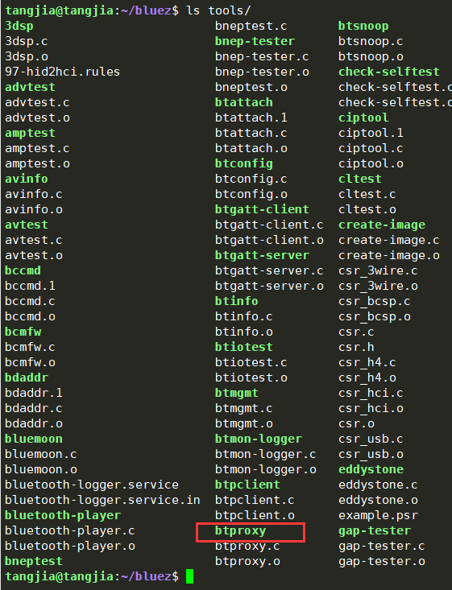
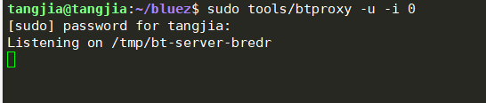
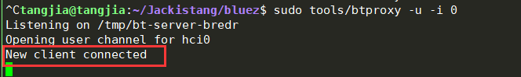
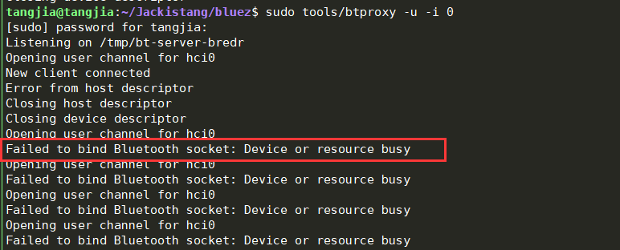
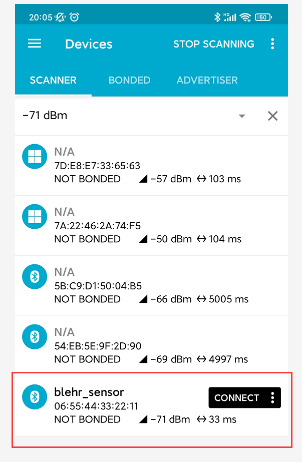

# QEMU 环境运行 BLE

## 环境介绍

本次搭建环境所使用的资源和版本为：

- Ubuntu 18.04
- Bluez - v5.55
- ell - v0.35
- qemu - v2.11.1
- RT-Thread - v4.0.3
- 一个蓝牙适配器

## 环境搭建

环境搭建主要分为两部分，

1. bluez 的编译
2. Ubuntu 18.04 里 RT-Thread QEMU 环境的搭建

首先需要更新源：

```shell
sudo apt update
sudo apt upgrade
```

安装所需要的依赖：

```shell
sudo apt install git automake libtool libelf-dev elfutils libdw-dev libjson-c-dev libical-dev libreadline-dev libglib2.0-dev libdbus-1-dev libudev-dev libncurses5-dev python3 python3-pip qemu
```

### bluez 编译安装

bluez 里有许多实用的工具，例如 `btproxy`，但是 Ubuntu 自带的 bluez 并未将这些工具都编译出来，因此需要我们重新编译 bluez。

在相同目录下克隆获取 0.35 版本的 ell，5.55 版本的 bluez 。

```shell
git clone -b 0.35 git://git.kernel.org/pub/scm/libs/ell/ell.git
git clone -b 5.55 https://github.com.cnpmjs.org/bluez/bluez.git
```

最终 ell 和 bluez 应该在同一个目录级别下，目录结构为：

```shell
    .
        |--- ell
        |    |--- ell
        |    `--- unit
        `--- bluez
             |--- src
             `--- tools
```

然后输入下述命令编译 bluez：

```shell
cd bluez
./bootstrap-configure --disable-android --disable-midi --disable-mesh
make
```

这样我们就能在 bluez 里的 `tools` 目录下看到 `btproxy` 这个工具了。



-----

**注意：**出现 json-c 版本过低的错误时，我们需要手动编译安装 json-c ：

```shell
configure: error: json-c >= 0.13 is required
```

依次输入：

```shell
sudo apt install cmake

git clone -b json-c-0.15-20200726 https://github.com.cnpmjs.org/json-c/json-c.git
mkdir json-c-build && cd json-c-build
cmake ../json-c
make
sudo make install
```

### 搭建 RT-Thread QEMU 环境

参考 [文档：在 Ubuntu 平台开发 RT-Thread](https://www.rt-thread.org/document/site/#/rt-thread-version/rt-thread-standard/application-note/setup/qemu/ubuntu/an0005-qemu-ubuntu?id=在-ubuntu-平台开发-rt-thread) 完成 RT-Thread qemu 环境的搭建。

----

**注意：**若 scons 版本低于 v4.0.1，需要手动安装 scons，步骤如下：

```shell
git clone -b 4.0.1 https://github.com.cnpmjs.org/SCons/scons.git
cd scons
sudo python3 setup.py install
```

## QEMU 运行 BLE

qemu 运行 BLE 时，本质上还是在和物理机的蓝牙设备通信，下面介绍如何在 qemu 环境中使用蓝牙设备。

首先输入 `hciconfig` 查看本机的蓝牙设备，


我这里是 hci0 蓝牙设备，需要保证上述红框框住的部分为 `DOWN`，也就是该蓝牙设备未打开，否则需要输入下述命令关闭该蓝牙设备：

```shell
sudo hciconfig hci0 down
```

然后进入 bluez 的 tools 目录，输入命令为该蓝牙设备创建一个代理（proxy）。

```shell
sudo ./btproxy -u -i 0
```

其中 `-u` 代表使用 Unix Server，默认路径为 `/tmp/bt-server-bredr`，`-i 0` 指使用 hci0 蓝牙设备，如果是 hci1 蓝牙设备，则需更改为 `-i 1` 。运行成功后会有下述显示：



然后在 RT-Thread 的 bsp/qemu-vexpress-a9 目录下编译运行：

```shell
scons
qemu-system-arm -M vexpress-a9 -kernel rtthread.bin -nographic -serial mon:stdio -serial unix:/tmp/bt-server-bredr
```

即可成功在 qemu 环境里与蓝牙卡片交互，下面稍微介绍下原理和注意事项。

qemu 命令参数里与串口相关的有 `-serial mon:stdio -serial unix:/tmp/bt-server-bredr`，`-serial` 参数的介绍为：

> -serial dev redirect the serial port to char device 'dev'

这个参数将 qemu 程序的串口重定向到物理机的设备文件，

第一个`-serial mon:stdio` 将 qemu 里的 uart0 重定向到了物理机的 stdio 设备文件，而且在 qemu 程序里 uart0 用作 msh 命令行工具，类似 stdio，因此我们可以在物理机上看到 qemu 程序的打印数据，也可以输入命令。

第二个 `-serial unix:/tmp/bt-server-bredr` 是将 qemu 里的 uart1 重定向到物理机的 /tmp/bt-server-bredr 文件，而这个文件又是 hci0 设备的代理，因此从 qemu 程序的角度来看，就是使用 H4 协议，通过 uart1 去访问蓝牙设备。uart1 的波特率使用 115200 即可（未找到说明，但一般都是这样使用）。

**注意：上述两个 -serial 的顺序不能颠倒，否则 qemu 程序无法正常运行。**

---

若成功运行，则在 btproxy 界面会有如下显示：



若蓝牙设备未关闭，则会显示设备或资源忙：



建议每次运行前都关闭一次蓝牙设备：`sudo hciconfig hci0 down` 。

## 例程

编译运行下述代码，

```c
/*
 * Copyright (c) 2006-2020, RT-Thread Development Team
 *
 * SPDX-License-Identifier: Apache-2.0
 *
 * Change Logs:
 * Date           Author       Notes
 * 2020/12/31     Bernard      Add license info
 */

#include <stdint.h>
#include <stdio.h>
#include <stdlib.h>
#include <rtthread.h>
#include <rtdevice.h>

uint8_t ad_data[] = { 0x01, 0x08, 0x20, 0x20, 0x14, 0x02, 0x01, 0x06, 0x0d, 
                    0x09, 0x62, 0x6c, 0x65, 0x68, 0x72, 0x5f, 0x73, 0x65, 0x6e, 
                    0x73, 0x6f, 0x72, 0x02, 0x0a, 0x00, 0x00, 0x00, 0x00, 0x00, 
                    0x00, 0x00, 0x00, 0x00, 0x00, 0x00, 0x00 };

uint8_t ad_params[] = { 0x01, 0x06, 0x20, 0x0f, 0x30, 0x00, 0x60, 0x00, 0x00, 
                    0x01, 0x00, 0x00, 0x00, 0x00, 0x00, 0x00, 0x00, 0x07, 0x00 };

uint8_t ad_enable[] = { 0x01, 0x0a, 0x20, 0x01, 0x01 };

static void print_command(uint8_t *buf, uint16_t len)
{
    rt_kprintf("CMD => ");
    for (uint16_t i = 0; i < len; i++) {
        rt_kprintf("%02X ", buf[i]);
    }
    rt_kprintf("\n");
}

static void print_event(uint8_t *buf, uint16_t len)
{
    rt_kprintf("EVT <= ");
    for (uint16_t i = 0; i < len; i++) {
        rt_kprintf("%02X ", buf[i]);
    }
    rt_kprintf("\n");
}

int main(void)
{
    uint8_t recv[50];
    uint16_t recv_len;

    rt_device_t ble = rt_device_find("uart1");
    rt_device_open(ble, RT_DEVICE_FLAG_INT_RX);;

    // Set advertisement data
    print_command(ad_data, sizeof(ad_data));
    rt_device_write(ble, 0, ad_data, sizeof(ad_data));
    rt_thread_mdelay(10);
    recv_len = rt_device_read(ble, 0, recv, sizeof(recv));
    print_event(recv, recv_len);

    // Set advertisement parameters
    print_command(ad_params, sizeof(ad_params));
    rt_device_write(ble, 0, ad_params, sizeof(ad_params));
    rt_thread_mdelay(10);
    recv_len = rt_device_read(ble, 0, recv, sizeof(recv));
    print_event(recv, recv_len);

    // Enable advertisement
    print_command(ad_enable, sizeof(ad_enable));
    rt_device_write(ble, 0, ad_enable, sizeof(ad_enable));
    rt_thread_mdelay(10);
    recv_len = rt_device_read(ble, 0, recv, sizeof(recv));
    print_event(recv, recv_len);

    printf("hello rt-thread\n");

    return 0;
}

```

打印的日志应为：

```shell
 \ | /
- RT -     Thread Operating System
 / | \     4.0.3 build Sep  5 2021
 2006 - 2020 Copyright by rt-thread team
lwIP-2.0.2 initialized!
[I/utest] utest is initialize success.
[I/utest] total utest testcase num: (1)
[I/sal.skt] Socket Abstraction Layer initialize success.
CMD => 01 08 20 20 14 02 01 06 0D 09 62 6C 65 68 72 5F 73 65 6E 73 6F 72 02 0A 00 00 00 00 00 00 00 00 00 00 00 00 
EVT <= 04 0E 04 01 08 20 00 
CMD => 01 06 20 0F 30 00 60 00 00 01 00 00 00 00 00 00 00 07 00 
EVT <= 04 0E 04 01 06 20 00 
CMD => 01 0A 20 01 01 
EVT <= 04 0E 04 01 0A 20 00 
hello rt-thread
```

使用 **nRF Connect** 手机 APP 即可成功观察到 qemu 程序发送的广播包，名称为 **blehr_sensor** 。

