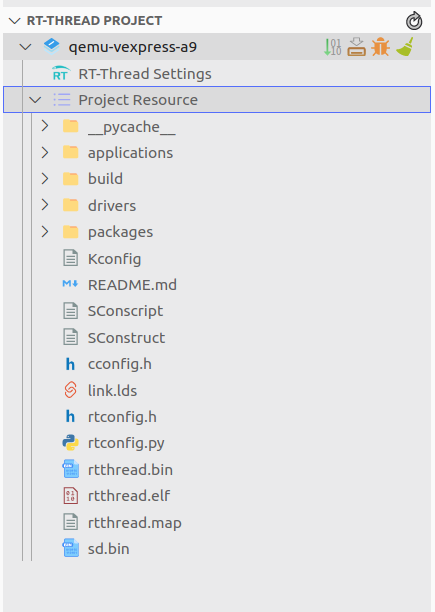
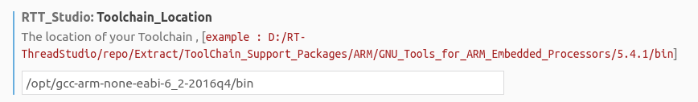
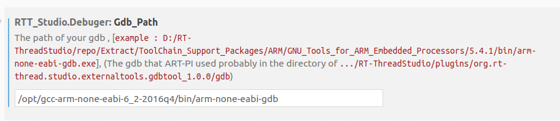

# RT-Thread Ubuntu 18.04 qemu 环境搭建

本文章是官方文档[在 Ubuntu 平台开发 RT-Thread](https://www.rt-thread.org/document/site/#/rt-thread-version/rt-thread-standard/application-note/setup/qemu/ubuntu/an0005-qemu-ubuntu) 的补充材料，记录了我实际搭建过程中遇到的问题。

基础环境：

- Ubuntu 18.04
- 按照官方文档搭建的环境

## scons 版本太低

在按照官方文档搭建环境的过程中，使用命令

```shell
sudo apt-get install scons
```

安装 scons 时，ubuntu 18.04 默认版本为 v3.0.1，如果这时去执行命令

```shell
scons --menuconfig
```

应该会出现错误，错误信息如下：

```shell
scons: Reading SConscript files ...
AttributeError: 'NoneType' object has no attribute 'groups':
  File "/home/tangjia/Jackistang/rt-thread/bsp/qemu-vexpress-a9/SConstruct", line 29:
    objs = PrepareBuilding(env, RTT_ROOT)
  File "/home/tangjia/Jackistang/rt-thread/bsp/qemu-vexpress-a9/../../tools/building.py", line 337:
    PreProcessor.process_contents(contents)
  File "/usr/lib/scons/SCons/cpp.py", line 307:
    self.tuples = self.tupleize(contents)
  File "/usr/lib/scons/SCons/cpp.py", line 287:
    return  [(m[0],) + Table[m[0]].match(m[1]).groups() for m in cpp_tuples]
  File "/usr/lib/scons/SCons/cpp.py", line 287:
    return  [(m[0],) + Table[m[0]].match(m[1]).groups() for m in cpp_tuples]
```

这个问题网上找不到解决方法，我就一点一点地尝试，发现是 scons 版本太低的问题，安装 v4.0.1 版本就成功运行上述命令了。

安装最新 scons 版本方法如下：

- 去 [SCons](https://scons.org/pages/download.html) 官网下载最新的稳定版本。
- 下载完成解压后，运行 `python3 setup.py install` 即可。

输入 `scons --version` 验证是否安装成功，应该为下述信息：

```shell
SCons by Steven Knight et al.:
	SCons: v4.0.1.c289977f8b34786ab6c334311e232886da7e8df1, 2020-07-17 01:50:03, by bdbaddog on ProDog2020
Copyright (c) 2001 - 2020 The SCons Foundation
```

## VSCode 调试

官方文档里目前关于 Linux 环境调试 qemu 程序的介绍，仍然是使用 `qemu-dbg.sh` 脚本，但是用户仍旧需要自己处理 gdb server 和 gdb client 的问题，而且极有可能失败，网络上有许多关于 qemu 环境调试的问题。

Windows 系统上可以使用 RT-Thread Studio 来解决，而 RT-Thread 最近推出的 **VSCode 插件** RT-Thread Studio 则完美地解决了 Linux / MacOS 环境 qemu 程序的调试问题，下面介绍下如何使用该插件。

在 VSCode 插件搜索界面输入 RT-Thread Studio ，并安装。

打开 bsp/qemu-vexpress-a9 目录，会看见下述的项目列表，



而且右上角有 4 个按钮：


依次是 **构建**，**下载**，**调试**，**清除** 。

点击相应的按钮，插件会提示你输入 arm-none-eabi- 交叉编译器的安装地址，



gdb 的地址，



以及 RT-Thread 的源码地址。

之后点击 **调试** 按钮就能够直接进行调试了，无需任何额外配置。**吹爆这个插件！**

